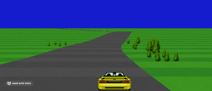

# ReTurbo

Some fun with [Reprocessing](https://github.com/schmavery/reprocessing) and [BsbNative](https://github.com/bsansouci/bsb-native)

## How To
### Install
`yarn`

### Build
`yarn build`

### Start
There are two ways to try this out:

After building you could run a static server, like `python -m SimpleHTTPServer` and go to `localhost:8000`. Or you're using safari you can simply open the `index.html` and tick `Develop > Disable Cross-Origin Restrictions`.

Alternatively using webpack: `yarn serve` will host the game at `localhost:8000` 

### Controls

Use the arrow keys to turn and brake, whilst space restarts the game. Alternatively, click/touch 
the edges to turn and the timer to restart. 

## Fun Stuff I used or forked

* [ReScript](https://rescript-lang.org)
* [Reprocessing](https://github.com/schmavery/reprocessing)
* [ReasonGl](https://github.com/bsansouci/reasongl-web)
* [Webpack](https://github.com/webpack/webpack)
